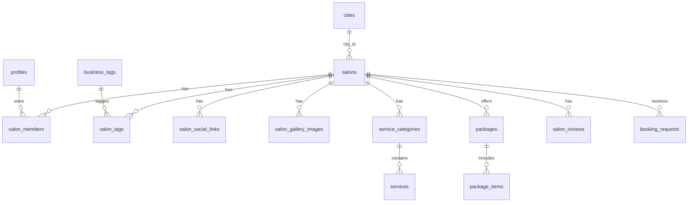

# SalonMenu.pk — MVP database (Supabase)

## Quick start

1. [Supabase](https://supabase.com) → New project  
2. **SQL Editor** → New query  
3. Paste and run: [`supabase/mvp-schema.sql`](../supabase/mvp-schema.sql)  
4. **Table Editor** → confirm tables exist  
5. (Later) Import salon rows from `salons/data.json`

## Entity diagram (MVP)

## Tables

| Table | Purpose |
|-------|---------|
| `profiles` | Users (customer / salon_owner / admin) — links to `auth.users` |
| `cities` | Lahore, Karachi, … for browse-by-city |
| `salons` | Core listing (slug, WhatsApp, hero, status) |
| `salon_members` | Owner/staff access to a salon |
| `business_tags` + `salon_tags` | “Bridal Expert”, “Ladies Only”, … |
| `salon_social_links` | Instagram, Facebook, TikTok |
| `salon_gallery_images` | Ordered gallery URLs |
| `service_categories` | Facial, Hair, Makeup, … per salon |
| `services` | Menu line items with PKR price |
| `packages` + `package_items` | Combo deals |
| `salon_reviews` | Testimonials on salon page |
| `booking_requests` | WhatsApp booking log (analytics / dashboard) |
| `platform_leads` | “List your salon”, newsletter signups |

## Maps from `salons/data.json`

| JSON field | Database |
|------------|----------|
| object key (`noor`) | `salons.slug` |
| `name`, `tagline`, `city`, `area` | `salons.*` |
| `whatsapp`, `phone`, `timings` | `salons.*` |
| `color` | `salons.brand_color` |
| `hero_image` | `salons.hero_image_url` |
| `gallery[]` | `salon_gallery_images` |
| `business_tags[]` | `business_tags` + `salon_tags` |
| `socials` | `salon_social_links` |
| `services.{Category}[]` | `service_categories` + `services` |
| `packages[]` | `packages` + `package_items` |
| `reviews[]` | `salon_reviews` |
| `stats.rating` | `salons.stats_rating` |

## Public API usage (later)

- Homepage grid: `select * from v_published_salons order by is_featured desc, name`
- Salon menu: join `salons`, `service_categories`, `services`, `packages`, `package_items`
- Insert booking: `insert into booking_requests (...)`

## RLS summary

- **anon / public:** read `published` salons and children; insert `booking_requests`, `platform_leads`
- **authenticated owner:** read/update own salons via `salon_members`
- **admin:** extend policies as needed

## Phases (see `product-upgrade-plan.md`)

| Phase | Schema already supports |
|-------|-------------------------|
| Owner dashboard | `salon_members`, `salons.status` |
| Verified badges | `verification_status` |
| Analytics | `booking_requests`, `platform_leads` |
| Reviews on homepage | `salon_reviews.is_verified` |
| Blog | new `blog_posts` table (future) |
